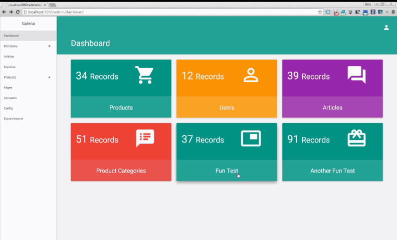

# Scorpius Dashboards

![Scorpius][1]

## Overview
Core Dashboards package for the Scorpius framework.


[1]: https://raw.githubusercontent.com/scorpiusjs/graphics/master/logos/scorpiusjs-logo.png




## Instructions
1. Install the package
```sh
$ meteor add scorpiusjs:dashboards
```
2. Register your widget by following `Client`
3. Register access to the dashboard by setting `Options.set('showDashboard', true)` within your lib directory. If you have used the Example project from the scorpius repository this will typically be in the *lib/options.js* file.
4. If using the default widget template follow the instructions below
5. Navigate to `/admin/dashboard/` to see your new widget.

## Register a custom Widget
1. From the instructions above register a new widget `Client`. 
2. In your widget declaration pass your template as the template key.
3. Ensure that the values you want to display in your widget is passed in the registration as individual keys. 

>**Note** `scorpius.dashboard.registerWidget` must be passed as an object, and template is a required field. If you do not set the template, it will default to your themes default template.

## Tips
For the best experience, if utilizing the default widgets, you will need to use `tmeasday:publish-counts` to publish the total Count of a collections records. See their documentation for instructions on publishing the record counts.

> A tutorial will be provided in the documentation demonstrating how to complete this task.

## Default Widget Guide

### Publish Counts `Server`
```js
Meteor.publish('allProducts', function () {
	Counts.publish(this, 'totalProducts', Products.find());
});
```

### Register Widget `Client`
```js
scorpius.dashboard.registerWidget({
	template: 'default',
	publication: 'allProducts',
	count: 'totalProducts',
	label: 'Products',
	path: '/admin/products/',
	baseColor: 'blue',
	icon: 'shopping_cart',
	textColor: 'white'
});
```